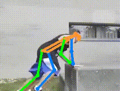
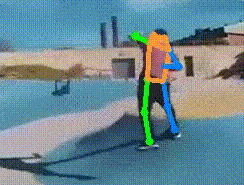

# Human Pose as Compositional Tokens

<p align="center">
  <a href="https://sites.google.com/view/pctpose">Page</a> |
  <a href="https://arxiv.org/pdf/2303.11638.pdf">Arxiv</a> |
  <a href="https://www.youtube.com/watch?v=eXt_ONASk5E">Video</a> |
  <a href="#Environment">Environment</a> |
  <a href="#Usage">Usage</a> |
  <a href="#Acknowledge">Acknowledge</a> |
  <a href='#Citation'>Citation</a> 
</p>

<div align="center">
  
  
</div>

## Environment
The code is developed using python 3.8 on Ubuntu 16.04. The code is developed and tested using 8 NVIDIA V100 GPU cards. Other platforms are not fully tested.

## Usage
### Installation
1. Clone this repo.
2. Setup conda environment:
   ```
   conda create -n PCT python=3.8 -y
   conda activate PCT
   pip install -r requirements.txt
   ```

### Data Preparation

To obtain the COCO dataset, it can be downloaded from the [COCO download](http://cocodataset.org/#download), and specifically the 2017 train/val files are required. Additionally, the person detection results can be acquired from the [HRNet](https://github.com/leoxiaobin/deep-high-resolution-net.pytorch) repository. The resulting data directory should look like this:

    ${POSE_ROOT}
    |-- data
    `-- |-- coco
        `-- |-- annotations
            |   |-- person_keypoints_train2017.json
            |   `-- person_keypoints_val2017.json
            |-- person_detection_results
            |   |-- COCO_val2017_detections_AP_H_56_person.json
            |   |-- COCO_test-dev2017_detections_AP_H_609_person.json
            `-- images
                |-- train2017
                |   |-- 000000000009.jpg
                |   |-- 000000000025.jpg
                |   |-- 000000000030.jpg
                |   |-- ... 
                `-- val2017
                    |-- 000000000139.jpg
                    |-- 000000000285.jpg
                    |-- 000000000632.jpg
                    |-- ... 

### Model [Zoo](https://mailustceducn-my.sharepoint.com/:f:/g/personal/aa397601_mail_ustc_edu_cn/EjGyRWSC7AZFukfefijQsK8ButemCzR8lLOdYWUPg5U2dg?e=4F2oEL)

To use this codebase, we provide the following models and tools:
1. SimMIM Pretrained Backbone: We provide SimMIM pre-trained swin [models](https://mailustceducn-my.sharepoint.com/:f:/g/personal/aa397601_mail_ustc_edu_cn/EgtBx4MGIFtKvfugHBycSucBfbsFt92X86HM_fgnzl0Z1w?e=OYsYqy) that you can download. Alternatively, you can use [SimMIM](https://github.com/microsoft/SimMIM) repository to pretrain your own models. (Note: When loading the SimMIM model, it is normal to encounter missing keys in the source state_dict, including relative_coords_table, relative_position_index, and norm3. These missing keys do not affect the results.)
2. Heatmap Trained Backbone: We offer swin [models](https://mailustceducn-my.sharepoint.com/:f:/g/personal/aa397601_mail_ustc_edu_cn/EiHuJ2SUpOhEmbuEXS5KkDUBBaeRlz2QyVnEcDwDUuJtwA?e=dCiiP1) that are trained on the COCO dataset with heatmap supervision. If you prefer, you can also train your own swin backbone using the command: `./tools/dist_train.sh configs/hmp_[base/large/huge].py 8`
3. [Optional] Well-Trained Tokenizers: You can download well-trained PCT tokenizers in the [zoo](https://mailustceducn-my.sharepoint.com/:f:/g/personal/aa397601_mail_ustc_edu_cn/Esvcc0LSurFLjhPGRJ-ZbSAB61A1q2rFWgePjHygbdwMLA?e=pXgisB).
4. [Optional] Well-Trained Pose Models: Our well-trained PCT pose models can be found in the [zoo](https://mailustceducn-my.sharepoint.com/:f:/g/personal/aa397601_mail_ustc_edu_cn/Epf3xVN8lJ9Km4qGQePCKR4Bl809PZXxXJETzWz6LFuFig?e=PbG3Ps).

After completing the above steps, your models directory should look like this:

    ${POSE_ROOT}
    |-- weights
    `-- |-- simmim
        |   `-- swin_[base/large/huge].pth
        |-- heatmap
        |   `-- swin_[base/large/huge].pth
        |-- tokenizer [Optional]
        |   `-- swin_[base/large/huge].pth
        `-- pct [Optional]
            `-- swin_[base/large/huge].pth 

### PCT

#### Stage I: Training Tokenizer

```
./tools/dist_train.sh configs/pct_[base/large/huge]_tokenizer.py 8
```
Aftering training tokenizer, you should move the well-trained tokenizer from the `work_dirs/pct_[base/large/huge]_tokenizer/epoch_50.pth` to the `weights/tokenizer/swin_[base/large/huge].pth` and then proceed to the next stage. Alternatively, you can change the config of classifier using `--cfg-options model.keypoint_head.tokenizer.ckpt=work_dirs/pct_[base/large/huge]_tokenizer/epoch_50.pth` to train the classifier.

#### Stage II: Training Classifier

```
./tools/dist_train.sh configs/pct_[base/large/huge]_classifier.py 8
```

Finally, you can test your model using the script below.
```
./tools/dist_test.sh configs/pct_[base/large/huge]_classifier.py work_dirs/pct_[base/large/huge]_classifier/epoch_210.pth 8 --cfg-options data.test.data_cfg.use_gt_bbox=False
```

#### Remove image guidance
Additionally, you can choose a cleaner PCT that removes image guidance. The benefit of this approach is that it doesn't require features from a backbone trained on COCO with heatmap supervision. Instead, it directly converts joint coordinates into compositional tokens, making it easier to perform various visualization and analysis tasks. This approach has a slightly reduced performance impact.
```
./tools/dist_train.sh configs/pct_base_woimgguide_tokenizer.py 8
./tools/dist_train.sh configs/pct_base_woimgguide_classifier.py 8
```

#### Demo

You need to install mmdet==2.26.0 and mmcv-full==1.7.0, and then use the following command to generate some image demos.
```
PYTHONPATH="$(dirname $0)/..":$PYTHONPATH python vis_tools/demo_img_with_mmdet.py vis_tools/cascade_rcnn_x101_64x4d_fpn_coco.py https://download.openmmlab.com/mmdetection/v2.0/cascade_rcnn/cascade_rcnn_x101_64x4d_fpn_20e_coco/cascade_rcnn_x101_64x4d_fpn_20e_coco_20200509_224357-051557b1.pth configs/pct_[base/large/huge]_classifier.py weights/pct/swin_[base/large/huge].pth --img-root images/ --img your_image.jpg --out-img-root images/ --thickness 2
```

## Acknowledge

Thanks to 
- [MMPose](https://github.com/open-mmlab/mmpose)
- [HRNet](https://github.com/HRNet)
- [VQVAE](https://github.com/zalandoresearch/pytorch-vq-vae)
- [MLPMixer](https://github.com/920232796/MlpMixer-pytorch)

## Citation

```
@inproceedings{Geng23PCT,
	author={Zigang Geng and Chunyu Wang and Yixuan Wei and Ze Liu and Houqiang Li and Han Hu},
	title={Human Pose as Compositional Tokens},
	booktitle={{CVPR}},
	year={2023}, 
}
```
